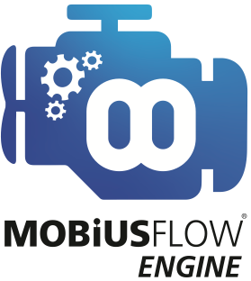

# MobiusFlow Engine Rest API

**The Mobius**Flow**® Engine can be installed as a standalone system or pre-configured and be distributed to multiple locations using the Mobius**Flow**® Toolbox.**

This allows the operator control and analysis of multiple sites remotely from a single toolbox whilst enabling individual response via a standalone Toolbox with visibility of that specific location with allocated user control such as a building manager or maintenance team. The Engine can be installed on compatible hardware such as a server, PC or edge gateway.

The **Mobius**Flow**® Engine Rest API** enables the **Mobius**Flow**® Toolbox** and 3rd party systems to configure the engine, and update and receive live data from **Mobius**Flow**®** [services and objects](https://docs.mobiusflow.com/v/untitled/architecture#mobius\_nodes).
